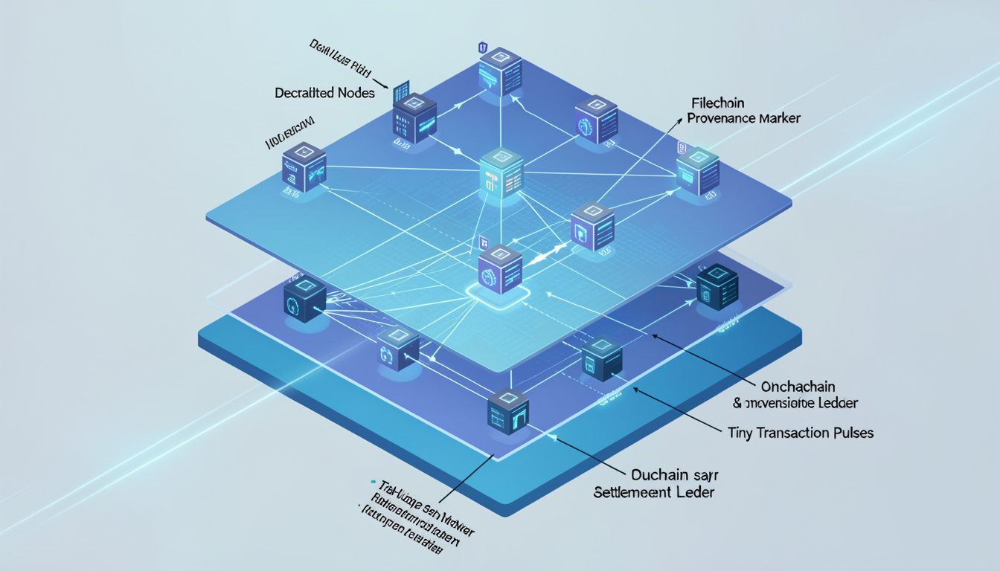
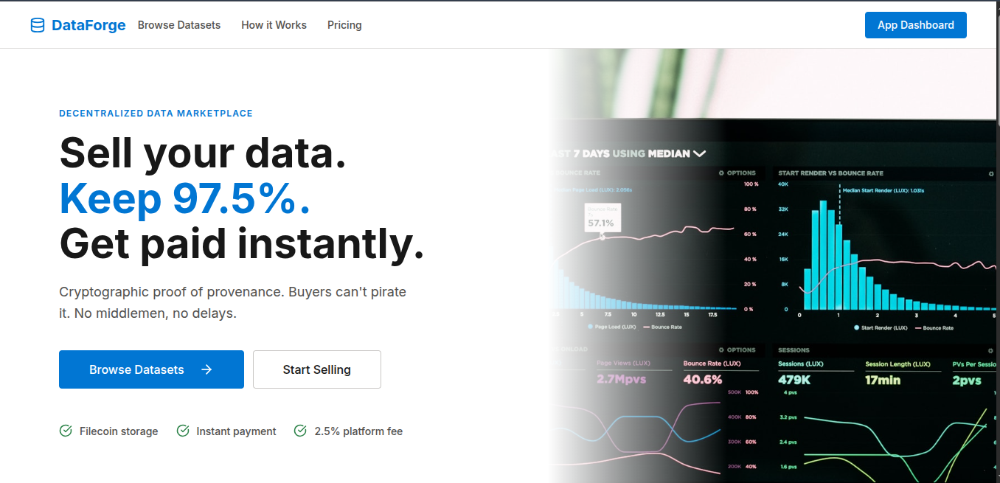
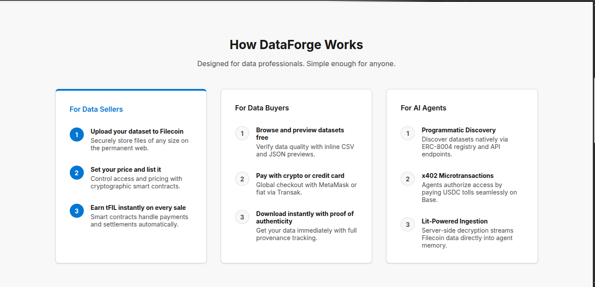

<div align="center">



# DataForge

### Provenance on Filecoin. Settlement onchain. Agentic access via x402 microtransactions.

A dual-layer decentralized data marketplace where every dataset is backed by a verifiable Filecoin CID, cryptographically gated by Lit Protocol, and accessible to both humans and autonomous AI agents — without API keys, signups, or intermediaries.

[](https://calibration.filfox.info/en)
[](https://developer.litprotocol.com)
[](https://eips.ethereum.org/EIPS/eip-8004)
[](https://x402.org)
[](./LICENSE)


[🚀 Live Demo](#) · [📺 Watch Demo Video](https://youtu.be/M2nowoVbRWE) · [⚡ Quickstart](./QUICKSTART.md)

</div>

---

## 📺 Demo Video

[](https://www.youtube.com/watch?v=M2nowoVbRWE)

---

## Table of Contents

1. [Overview](#1-overview)
2. [How It Works](#2-how-it-works)
3. [Architecture](#3-architecture)
4. [Tech Stack](#4-tech-stack)
5. [Core Integrations](#5-core-integrations)
   - [Lit Protocol](#-lit-protocol)
   - [Filecoin + Synapse SDK](#-filecoin--synapse-sdk)
   - [ERC-8004 Agent Identity](#-erc-8004-agent-identity)
   - [x402 Microtransactions](#-x402-microtransactions)
6. [Smart Contracts](#6-smart-contracts)
7. [Agent Demo](#7-agent-demo)
8. [Setup & Installation](#8-setup--installation)
9. [Repository Structure](#9-repository-structure)
10. [Bounty Alignment](#10-bounty-alignment)
11. [Security Notes](#11-security-notes)
12. [Resources](#12-resources)

---

## 1. Overview




DataForge operates on **two distinct layers**:

**The Human Layer** is a React-based web marketplace. Sellers list datasets encrypted with Lit Protocol and stored on Filecoin. Buyers browse, purchase with FIL, and decrypt — all transparently via onchain smart contracts.

**The Agent Layer** is a passive Node.js platform agent registered with an ERC-8004 identity on Base Mainnet. External AI agents discover datasets via `GET /listings`, pay in USDC using the x402 protocol, and receive decrypted data bytes autonomously — no API keys, no signups, no human in the loop.

```
Human:  Browse → Buy with FIL → Decrypt via Lit → Download
Agent:  Discover → Reason → Pay USDC (x402) → Receive plaintext bytes
```

---

## 2. How It Works



### Producer Flow (Human)

| Step | Action | What Happens |
|------|--------|--------------|
| **1 — Upload** | Select a dataset file (CSV, JSON, etc.) | File is encrypted client-side via Lit Protocol with an onchain Access Control Condition |
| **2 — Store** | Click "Upload to Filecoin" | Encrypted bytes are uploaded via Synapse SDK; a `pieceCid` is returned and stored onchain |
| **3 — List** | Set name, description, and price | `DataMarketplace.sol` registers the listing with the CID and price |

### Buyer Flow (Human)

| Step | Action | What Happens |
|------|--------|--------------|
| **1 — Browse** | View available datasets | Frontend reads listings from `DataMarketplace.sol` |
| **2 — Purchase** | Click "Buy Now" and confirm in MetaMask | Smart contract records purchase; `isAuthorized()` returns true for buyer |
| **3 — Decrypt** | Click "Download Dataset" | Lit nodes verify the purchase onchain and release decryption keys |

### Buyer Flow (AI Agent)

| Step | Action | What Happens |
|------|--------|--------------|
| **1 — Discover** | `GET /listings` | Agent reads all available datasets from the platform API |
| **2 — Reason** | NEAR AI evaluates listings | Agent decides what to buy based on goal and budget |
| **3 — Pay** | x402 USDC microtransaction | No API key — payment is the authentication |
| **4 — Receive** | Platform agent brokers the purchase | Decrypts server-side via Lit, returns plaintext bytes to the requesting agent |

---

## 3. Architecture

### System Overview


### Agent Payment Flow


---

## 4. Tech Stack

| Layer | Technology | Purpose |
|-------|-----------|---------|
| **Smart Contracts** | Solidity — `DataMarketplace.sol` | Listings, purchases, fee distribution on Filecoin Calibration Testnet |
| **Storage** | `@filoz/synapse-sdk` | Filecoin upload, retrieval, and onchain CID confirmation |
| **Encryption / Access Control** | Lit Protocol v8 (Naga SDK) | Client-side encrypt, server-side decrypt, EVM contract ACC |
| **Agent Identity** | ERC-8004 on Base Mainnet (via Synthesis) | Verifiable agent identity, capability discovery |
| **Agent Payments** | `@x402/express` + `@x402/fetch` | USDC micropayments on Base Sepolia — payment as authentication |
| **Consumer Agent** | NEAR AI — DeepSeek via `consumer_agent.ts` | Autonomous reasoning, dataset selection, end-to-end purchase execution |
| **Frontend** | React + Vite + TypeScript | Human marketplace UI |
| **Infrastructure** | Docker + Nginx + docker-compose | Reproducible full-stack deployment |
| **Contract Tooling** | Hardhat + TypeScript | Compile, test (18 tests), deploy |

---

## 5. Core Integrations

### 🔐 Lit Protocol

DataForge uses **Lit Protocol V8 (Naga SDK)** as the cryptographic enforcement layer for the entire marketplace — not just encryption, but the authoritative gate on who can read data.

**Encryption** — when a seller uploads a dataset, it is encrypted via `client.encrypt()` with an Access Control Condition (ACC) tied to the `isAuthorized()` function of `DataMarketplace.sol`. The ciphertext is what gets stored on Filecoin.

**Access Control** — Lit nodes call `isAuthorized(listingId, userAddress)` onchain to verify a purchase before releasing decryption keys. No purchase = no decryption, cryptographically enforced without DataForge's servers being involved.

**Server-side Decryption** — the platform agent decrypts using `createEoaAuthContext` with a private key (no MetaMask required) via `storagePlugins.localStorageNode`, enabling fully headless autonomous agent access.

**Cross-chain** — encryption happens on Filecoin Calibration, Lit nodes run on their own network, and the ACC checks the Filecoin contract — demonstrating Lit's cross-chain programmable access control in a real production scenario.

---

### 🌐 Filecoin + Synapse SDK

**Dataset storage** — every listed dataset is uploaded as encrypted bytes to Filecoin Calibration via `synapse.storage.upload()`. The returned `pieceCid` is stored onchain in `DataMarketplace.sol`, permanently linking the listing to its verifiable storage proof.

**Agent identity storage** — the platform agent's `agent.json` (ERC-8004 identity manifest) is also stored on Filecoin, with its CID used as the `tokenURI` — linking onchain identity to decentralised, content-addressed storage.

**Retrieval** — both the frontend and the platform agent retrieve datasets via `synapse.storage.download()` using the CID read directly from the contract. No centralised CDN, no single point of failure.

---

### 🤖 ERC-8004 Agent Identity

**Agent registration** — the platform agent registers its identity via the Synthesis API, minting an ERC-8004 NFT on Base Mainnet. The `agent.json` capability manifest is stored on Filecoin; its CID becomes the `tokenURI`.

**Self-custody** — the NFT is transferred from Synthesis custody to the operator wallet via `npm run transfer`, making the agent fully self-sovereign and viewable on Basescan.

**Discoverability** — any ERC-8004 compatible agent network can discover DataForge by resolving the agent's identity and reading its capabilities and service endpoints, enabling permissionless agent-to-agent commerce.

---

### 💸 x402 Microtransactions

The x402 protocol turns HTTP requests into payment channels. External agents include a USDC payment in their request header — no API keys, no OAuth, no signup. The platform agent verifies the payment on Base Sepolia and fulfils the request. The USDC price is automatically calculated from the listing's FIL price using a CoinGecko oracle with a 60-second cache

---

## 6. Smart Contracts

> `DataMarketplace.sol` is deployed on **Filecoin Calibration Testnet**: [`0x6bf20ca98180651F08a2cDfB29e449F2467a4Fd8`](https://calibration.filfox.info/en/address/0x6bf20ca98180651F08a2cDfB29e449F2467a4Fd8)

The contract handles the full marketplace lifecycle:

- `createListing(pieceCid, price, name, description)` — register a dataset for sale
- `buyListing(listingId)` — record a purchase; emits `ListingPurchased`
- `isAuthorized(listingId, address)` — called by Lit nodes to verify purchase before decryption
- `withdrawFees()` — operator fee collection

The 18-test suite covers listing creation, purchase flows, access control, and edge cases.

```bash
npm test   # All 18 tests pass ✅
```

---

## 7. Agent Demo

The consumer agent (`consumer_agent.ts`) is powered by **NEAR AI** and runs fully autonomously:

```bash
cd backend
npm run consumer
```

The agent:
1. Discovers datasets from `GET /listings`
2. Reasons about which to buy based on its configured goal and budget
3. Pays USDC via x402 on Base Sepolia
4. Receives decrypted dataset bytes from the platform agent
5. Analyses the data and logs the complete run to `consumer_log.json`

No human clicks anything. The loop from discovery to analysis runs end-to-end without intervention.

---

## 8. Setup & Installation

### Prerequisites

- Docker & Docker Compose
- Node.js v20+
- MetaMask (for the human layer)
- tFIL — get from the [Calibration Faucet](https://faucet.calibnet.chainsafe-fil.io)
- USDFC — get from the same faucet (for Synapse storage deposits)

### Step 1 — Configure Environment

```bash
cp .env.example .env
# Fill in your PRIVATE_KEY, MARKETPLACE_ADDRESS, and API keys
```

### Step 2 — Compile & Test Contracts

```bash
npm run compile
npm test         # All 18 tests should pass ✅
```

### Step 3 — Deploy Contracts

```bash
npm run deploy
# Copy the deployed contract address to your .env as MARKETPLACE_ADDRESS
```

### Step 4 — Register Your Agent

```bash
cd backend
npm install
npm run register
# Creates ERC-8004 identity on Base Mainnet, saves to agent_log.json
```

### Step 5 — Start the Stack

```bash
docker-compose up --build -d
```

| Service | URL |
|---------|-----|
| Frontend (Human Layer) | `http://localhost:80` |
| Platform Agent API (Agent Layer) | `http://localhost:4000` |

### Step 6 — Claim Self-Custody

```bash
cd backend
npm run transfer
# Transfers ERC-8004 NFT to your wallet — viewable on Basescan
```

### Step 7 — Run the Agent Demo

```bash
cd backend
npm run consumer
# Watch the full autonomous loop execute and log to consumer_log.json
```

### MetaMask Configuration

Add Filecoin Calibration to MetaMask:

| Field | Value |
|-------|-------|
| Network Name | Filecoin Calibration |
| RPC URL | `https://api.calibration.node.glif.io/rpc/v1` |
| Chain ID | 314159 |
| Currency Symbol | tFIL |
| Block Explorer | `https://calibration.filfox.info/en` |

---

## 9. Repository Structure

```
DataForge/
├── contracts/
│   └── DataMarketplace.sol       # Core marketplace contract
├── deploy/
│   └── 01_deploy_marketplace.ts  # Hardhat deployment script
├── test/
│   └── DataMarketplace.test.ts   # 18 contract tests
├── backend/
│   ├── platform_agent.ts         # ERC-8004 agent + x402 server
│   ├── consumer_agent.ts         # NEAR AI autonomous buyer agent
│   ├── lit.ts                    # Server-side Lit Protocol decryption
│   ├── synapse.ts                # Filecoin download via Synapse SDK
│   ├── agent.json                # ERC-8004 identity manifest
│   ├── agent_log.json            # Agent registration log
│   ├── consumer_log.json         # Consumer agent execution log
│   └── .env.example
├── frontend/
│   ├── src/
│   │   ├── filecoin.ts           # Synapse SDK upload integration
│   │   ├── lit.ts                # Client-side Lit encryption
│   │   ├── components/           # React UI components
│   │   └── hooks/                # Custom React hooks
│   └── package.json
├── hardhat.config.ts
├── docker-compose.yml            # Full-stack Docker deployment
├── QUICKSTART.md
└── README.md
```

---

## 10. Bounty Alignment

### Filecoin — Challenge #7: Agent-Generated Data Marketplace

| Requirement | Status |
|-------------|--------|
| Marketplace contracts (listing, purchase, settlement) | ✅ |
| CID-rooted dataset storage via Synapse SDK | ✅ |
| Producer + consumer agent demo | ✅ |
| Deployed on Filecoin Calibration Testnet | ✅ |

### ERC-8004 — Agents With Receipts

| Requirement | Status |
|-------------|--------|
| Identity registry — ERC-8004 agent on Base Mainnet | ✅ |
| Agent identity linked to operator wallet (self-custody transfer) | ✅ |
| Autonomous agent architecture (plan → execute → verify → decide) | ✅ |
| `agent.json` + `agent_log.json` DevSpot compatibility | ✅ |
| All transactions viewable on Basescan | ✅ |

### Lit Protocol — NextGen AI Apps

| Requirement | Status |
|-------------|--------|
| Lit Protocol V8 (Naga SDK) for encryption and programmable access control | ✅ |
| EVM contract ACC gating decryption behind onchain purchase verification | ✅ |
| Server-side decryption enabling fully autonomous agent access | ✅ |
| Cross-chain access control (Filecoin contract + Lit nodes) | ✅ |

---

## 11. Security Notes

> ⚠️ This is a hackathon/demo project. For production use:

- Use cloud KMS (AWS KMS, HashiCorp Vault) instead of `.env` private keys
- Lit Protocol access control is configured for Filecoin Calibration Testnet — update ACCs for mainnet
- The x402 USDC price is dynamically calculated from FIL via CoinGecko oracle (60s cache). High-frequency production use requires multi-oracle consensus to prevent price manipulation

---

## 12. Resources

- [ERC-8004 Specification](https://eips.ethereum.org/EIPS/eip-8004)
- [x402 Payment Protocol](https://x402.org/)
- [Synapse SDK GitHub](https://github.com/FilOzone/synapse-sdk)
- [Lit Protocol v8 Docs](https://developer.litprotocol.com/sdk/introduction)
- [Filecoin Calibration Faucet](https://faucet.calibration.fildev.network)
- [Calibration Block Explorer](https://calibration.filfox.info/en)

---

<div align="center">

Built for **PL_Genesis: Frontiers of Collaboration** · March 2026

[GitHub](https://github.com/jerrygeorge360/DataForge) · [Twitter](#) · [Discord](#)

</div>